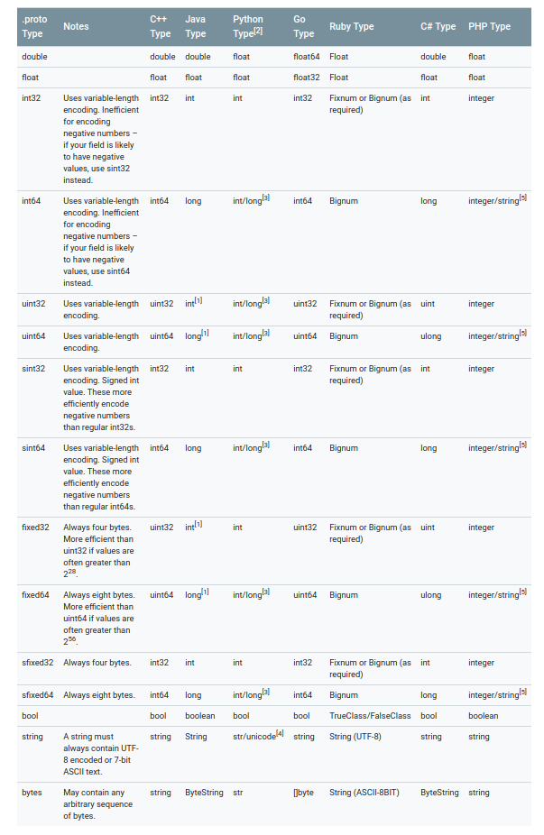

Language Guide (proto3)
-----------------------------
-----------------------------

[Language Guide (proto3)](https://developers.google.com/protocol-buffers/docs/proto3)

<!-- TOC -->

- [Defining A Message Type](#defining-a-message-type)
    - [Assigning Tags](#assigning-tags)
    - [Reserved Fields](#reserved-fields)
- [Scalar Value Types](#scalar-value-types)
- [Default Values](#default-values)
- [Updating A Message Type](#updating-a-message-type)
- [Maps](#maps)
- [Defining Service](#defining-service)
- [coding style](#coding-style)

<!-- /TOC -->

# Defining A Message Type

##  Assigning Tags  

在pb3解析字节流，创建内存对象的时候，需要知道字节流中哪些字节属于哪些域(fields)。所以tags是唯一的，一个message类型中，每个域都有自己独一无二的tag。

需要注意的是，tag小于16时，在字节流中只占用一个字节;如果大于等于16,会占用2个及多个字节。具体原理看[这篇文档](https://developers.google.com/protocol-buffers/docs/encoding)


## Reserved Fields

偶尔会有这样的需求：从当前版本的message删除几个fields，但又不想让后续的版本使用这几个fields对应的tags，因为有可能在未来某个版本里重新加入这几个fields而导致tag冲突。这时候就需要使用reserved fields这样的特性.

```protocol buffers
message Foo {
  reserved 2, 15, 9 to 11;
  reserved "foo", "bar";
}
```


# Scalar Value Types

这个列表是pb3里可用的scalar types。




# Default Values

message里的field存在默认值，当没有在rpc调用代码中制定某个field值的时候，这个filed的值会被制定为默认值。

不应该根据field是否是默认值来决定代码走向，因为很有可能这个field是没有被设置的。

|类型|默认值|
|-|-|
|bool|false|
|numeric types|0|
|enum|定义的第一个enum值，0|


代码示例:
```c
message SearchRequest {
  string query = 1;
  int32 page_number = 2;
  int32 result_per_page = 3;
  enum Corpus {
    UNIVERSAL = 0;
    WEB = 1;
    IMAGES = 2;
    LOCAL = 3;
    NEWS = 4;
    PRODUCTS = 5;
    VIDEO = 6;
  }
  Corpus corpus = 4;
}


//alias of enum
enum EnumAllowingAlias {
  option allow_alias = true;
  UNKNOWN = 0;
  STARTED = 1;
  RUNNING = 1;//ok
}
enum EnumNotAllowingAlias {
  UNKNOWN = 0;
  STARTED = 1;
  // RUNNING = 1;  // Uncommenting this line will cause a compile error inside Google and a warning message outside.
}
```


# Updating A Message Type


更新message类型是个很有用的特性。出于版本兼容的目的，可以大量使用reserved关键字来更新.proto文件。


# Maps

pb3中的map功能有限，有几个需要注意的地方:

* 不能用repeated来修饰map类型
* 不允许map嵌套  

# Defining Service

如果要和rpc一起使用，可以在.proto中定义好service，如下

```pb
service SearchService {
  rpc Search (SearchRequest) returns (SearchResponse);
}
```


# coding style

* service  
service和service中的rpc定义都采用驼峰法。
* message  
message采用驼峰法来定义，message中的fields采用小写下划线法定义。
* enum  
enum采用驼峰法定义，且首字母为大写;enum中的元素使用大写下划线法定义。